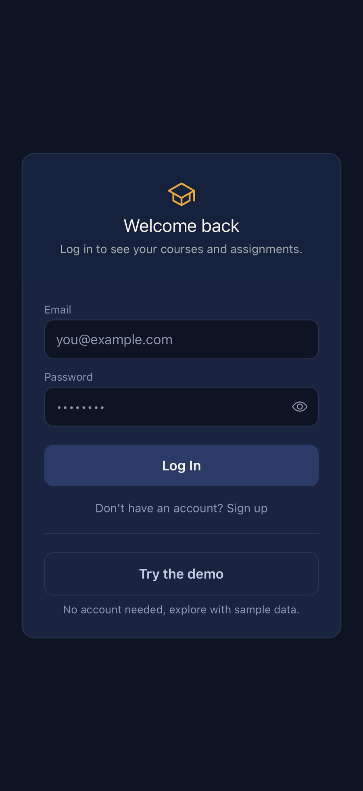
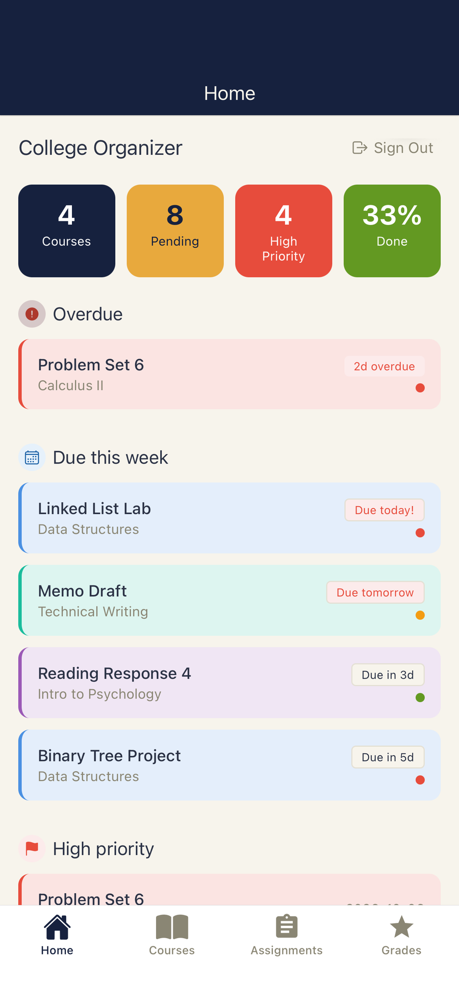
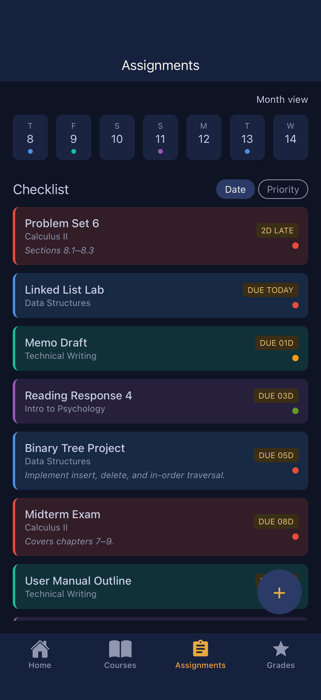
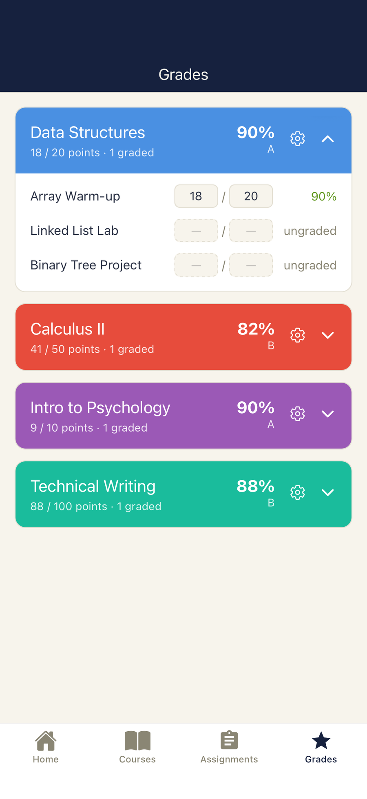
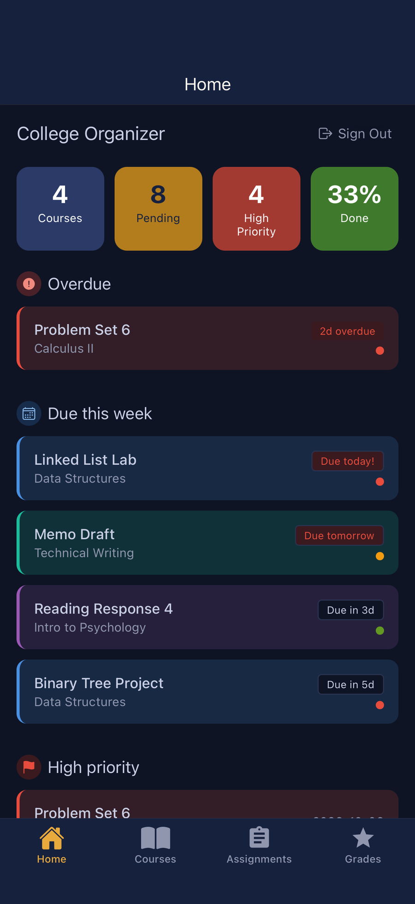

# College Organizer

[](https://github.com/cauansiqu/College_Organizer/actions/workflows/CI.yml)

A course, assignment, and grade tracker for college students, built from one
Expo/React Native codebase and backed by Supabase Postgres with per-user
row-level security. The web version is live and works on phones and laptops.
The native iOS and Android app runs in development through Expo Go and is not
in the app stores yet.

**Live app:** https://college-organizer-virid.vercel.app
Click **Try the demo** on the login screen. No account is needed, and you get
your own private copy of the sample data.

<p align="center">
  
  
  
  
  
</p>
<p align="center"><sub>Login, Home, Assignments, Grades, and Home in dark mode. Native iOS build running in Expo Go with the demo data.</sub></p>

## Features

- **Dashboard** with overdue, due-today, due-this-week, and high-priority
  summaries
- **Courses and assignments** with full create, edit, and delete
- **Calendar** (month grid on wide screens, week strip on phones) with
  tap-to-preview days and assignments
- **Checklist** sortable by due date or priority
- **Grades** per course: points earned over points possible, optional
  weighted categories, and letter-grade cutoffs you can set per course
- **Due-date reminders** in the native iOS and Android build (5, 3, and 1
  days before, plus the morning it's due)
- **Accounts** with email and password, email confirmation, and light and
  dark themes
- **Demo mode** using anonymous sign-in and seeded sample data

## Tech stack

| Layer | Choice |
|---|---|
| App | Expo (React Native) + Expo Router, TypeScript in strict mode |
| Backend | Supabase: Postgres, Auth, Row Level Security |
| Notifications | `expo-notifications`, scheduled on the device |
| Web hosting | Vercel |
| CI | GitHub Actions: type-check and lint on every push to `main` |

## How it's built

```
app/            Screens (Expo Router: folder names become routes)
components/     Shared UI: assignment form, calendar, date picker, modals
storage/        storage.ts, the one file every screen goes through for data
lib/            Supabase client, reminder scheduling, demo seeding
utils/          Date parsing, grade math, cross-platform alerts
supabase/       Version-controlled SQL migrations
```

**One data seam.** Every screen reads and writes through the functions in
`storage/storage.ts` and never talks to the database directly. The app began
with on-device storage only. Moving it to Supabase meant rewriting the inside
of that one file while the screens stayed the same.

**Security enforced by the database.** Each table has Row Level Security
policies limiting every read and write to `auth.uid() = user_id`. The
publishable key ships in the client by design, so the policies are what keep
one user's data from another, not the app code.

**Schema in version control.** The tables were first created by hand in the
dashboard, and the documented schema drifted from the real one. Schema
changes now go through SQL files in `supabase/migrations/`.

**Demo mode.** "Try the demo" signs the visitor in as an anonymous Supabase
user. The root layout holds a loading state while it seeds sample courses and
assignments, with due dates relative to today, so the app never opens empty.
Anonymous users get their own `user_id`, so the same RLS policies isolate
each visitor's copy.

## Problems I ran into

- **Dates shifting by a day.** `new Date("YYYY-MM-DD")` parses as UTC
  midnight, which is the previous day in US timezones. Two screens disagreed
  about what was due today. All parsing now goes through one helper that
  builds local dates.
- **RLS on with no policies.** Enabling Row Level Security without writing
  policies denies every request and returns empty results with no error.
- **Client-made ids versus database ids.** The app created ids with
  `Date.now()` while Postgres generated UUIDs, so edits and deletes missed
  their rows. Save functions now return the row the database created.
- **Web differences in React Native.** `Alert.alert()` does nothing on web,
  and the auth storage library crashed during the server pre-render step.
  Both are wrapped in small cross-platform helpers.

[`CLAUDE.md`](./CLAUDE.md) has the full list with details.

## Running it locally

```bash
git clone https://github.com/cauansiqu/College_Organizer.git
cd College_Organizer
npm install
```

Create a Supabase project, run the SQL files in `supabase/migrations/` in
order from the SQL editor, and turn on anonymous sign-ins if you want the
demo button to work. Then add a `.env` file in the project root:

```
EXPO_PUBLIC_SUPABASE_URL=your-project-url
EXPO_PUBLIC_SUPABASE_PUBLISHABLE_KEY=your-publishable-key
```

Start the dev server:

```bash
npx expo start        # QR code for a phone, plus options for web
npm run web           # or open straight in a browser
```

Checks that CI runs:

```bash
npx tsc --noEmit
npm run lint
```

## Limitations and what's next

- No automated tests yet. Correctness rests on the type-checker, lint, and
  manual testing. Unit tests for the grade math are the first planned.
- The native app isn't published to the app stores, so on a phone the live
  version is the website.
- Reminders are local to the device and don't run on web.
- Next: a visual redesign pass across all screens.

## About

A solo project by Cauan Siqueira, a Computer Science student at SIUE. It was
built with AI pair-programming (Claude Code); the design decisions,
debugging, and review of every change are mine.